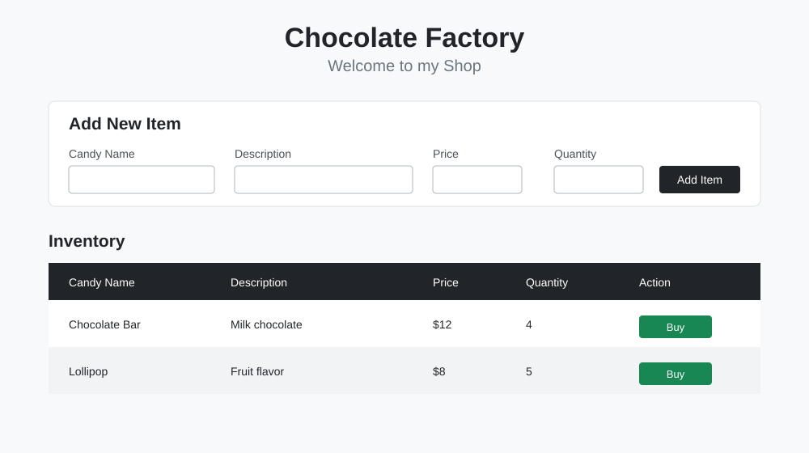
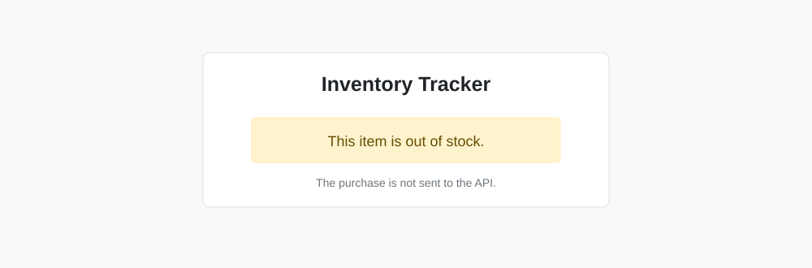

# Goods Monitoring System

This is a small inventory project for a shopkeeper. It lets you add candy items, see the current stock, and buy items from the list.

I made this project while learning how to use Axios and HTTP methods with JavaScript. I used CRUD CRUD as the backend so I could practice sending requests without building a server first.

## What the project can do

- Add a new item with its name, description, price, and quantity
- Load saved items from the API when the page opens
- Buy 1, 2, or 3 items at a time
- Update the quantity after a purchase
- Show an alert when there is not enough stock
- Stop a purchase when the item is already out of stock

## Axios and HTTP methods I used

The main API code is in `main.js`.

- `GET` loads all inventory items when the page opens.
- `POST` adds a new item from the form.
- `GET` loads the latest quantity before a purchase.
- `PUT` updates the item quantity after a successful purchase.

The project uses this CRUD CRUD endpoint format:

```text
https://crudcrud.com/api/<crud-id>/ShopItemTracker
```

## Files

- `index.html` contains the form and inventory table.
- `main.js` contains the Axios requests and the buy logic.

## Screenshots

### Inventory page



### Out of stock alert



## How to run it

1. Download or clone this repository.
2. Open `index.html` in a browser.
3. Add an item using the form.

The CRUD CRUD API ID can expire, so a new ID may be needed if the API stops responding.
